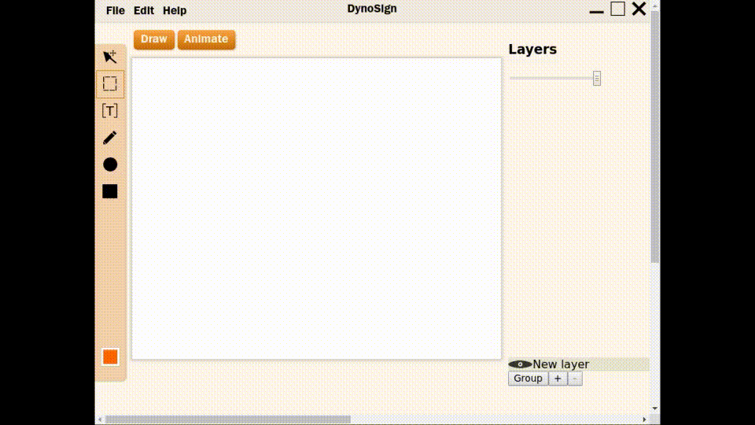
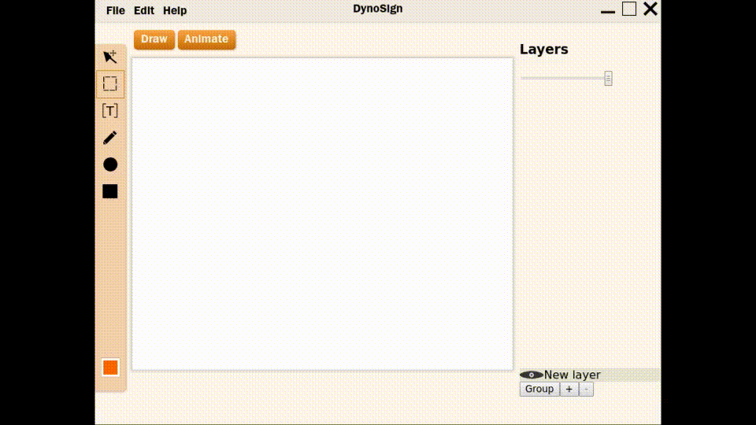
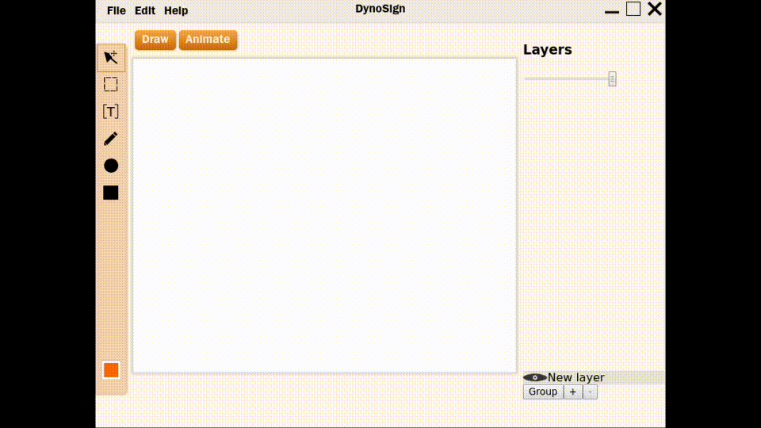
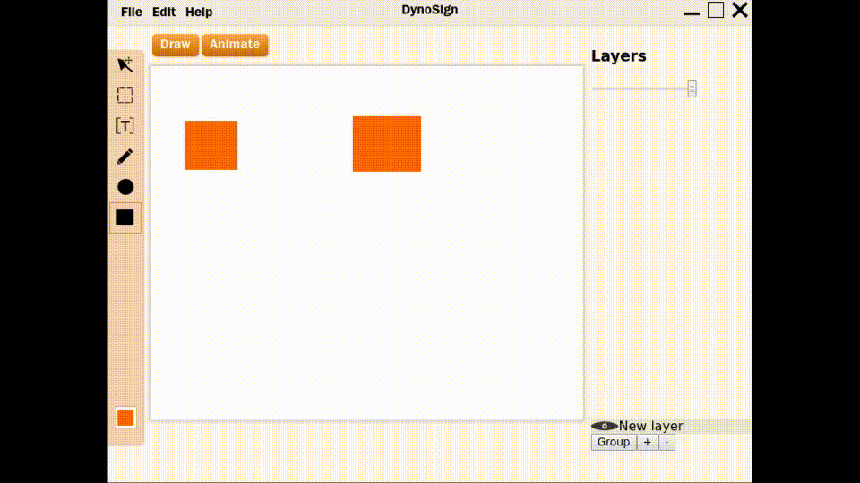

# Dynosign

Cross-platfrom UI graphical editor. Written with React and Redux. Currently in development, you need to download source code and build by yourself.

## Features

- Open source, anyone can contribute to development
- (still concept) Both UI constructing and animations features
- Layered interface, similar to all modern UI tools

## Working now

|Feature            |Demo                   |
|-------------------|-----------------------|
|Selection          ||
|Circle drawing     ||
|Rectangle drawing  ||
|Simple line drawing||
|Moving objects     ||
|Fonts (text tool)  ||
|Layer manipulation ||

## Why another Electron app?

This project is meant to be dead simple both to end users and developers. A lot of developers know JavaScript. Also, there exist a lot of libraries, which can help to develop application. Based on these facts, Electron is the best way to establish quick and working prototype

## How to build on local machine?

First of all, you will need a Node.JS and NPM. I'm using Arch Linux distro, but you can try on any supported by Node. 

| Build          | Develop              |
|----------------|----------------------|
|`npm i`         |`npm i`               |
|`npm run build` |`npm run watch`       |
|                |`npx electron-rebuild`|
|`npx electron .`|`npm start`           |

 # Join the team 
 Do you want to collaborate? Join the project at https://crowdforge.io/projects/552