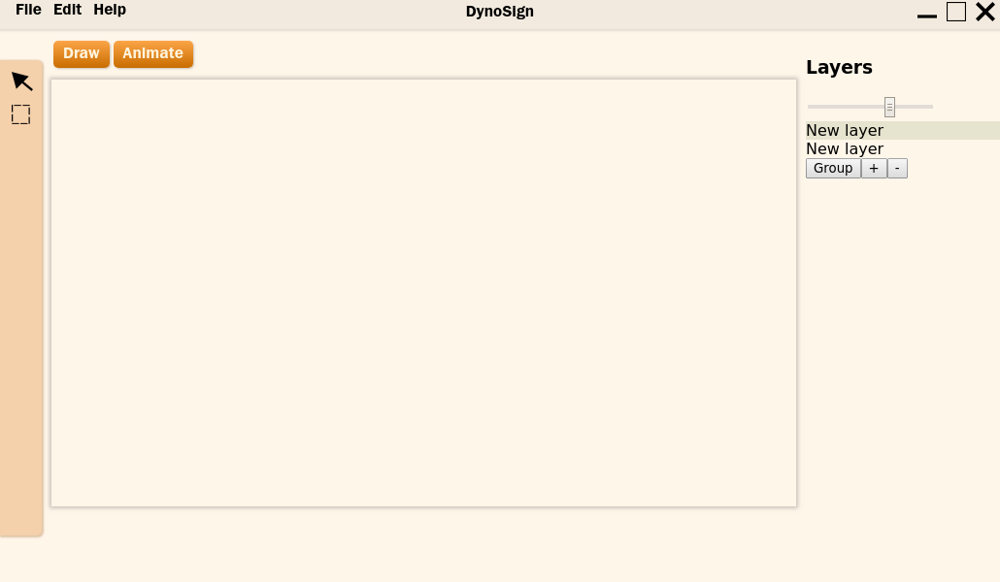

# Dynosign

One of multiple attempts to create Linux UI editors. Written with React and Redux

## Features

- Open source, anyone can contribute to development
- (still concept) Both UI constructing and animations features
- Layered interface, similar to all modern UI tools

## Why another Electron app?

This project is meant to be dead simple both to end users and developers. A lot of developers know JavaScript. Also, there exist a lot of libraries, which can help to develop application. Based on these facts, Electron is the best way to establish quick and working prototype

## How to build on local machine?

First of all, you will need a Node.JS and NPM. I'm using Arch Linux distro, but you can try on any supported by Node. 

- Run `npm i` to install dependencies from package.json
- In first terminal window type `npm run watch` to launch webpack server
- In second terminal type `npm start` to launch an Electron application
- (Optional) type `npm test` or `npm run test:watch` to run unit tests (Jest)